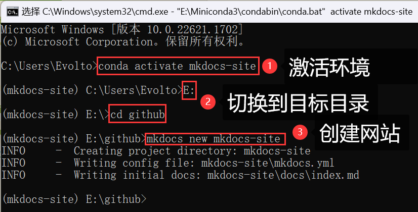
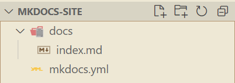
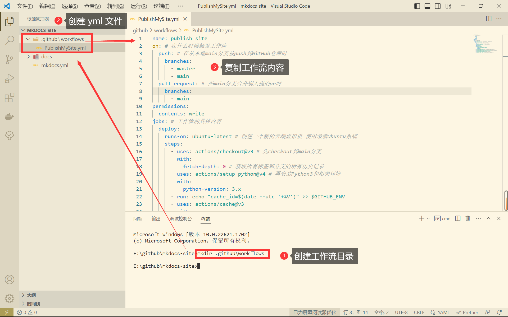
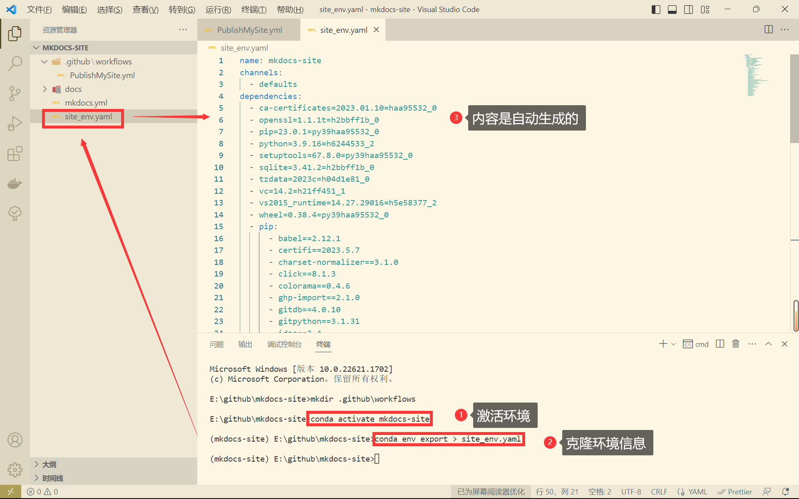
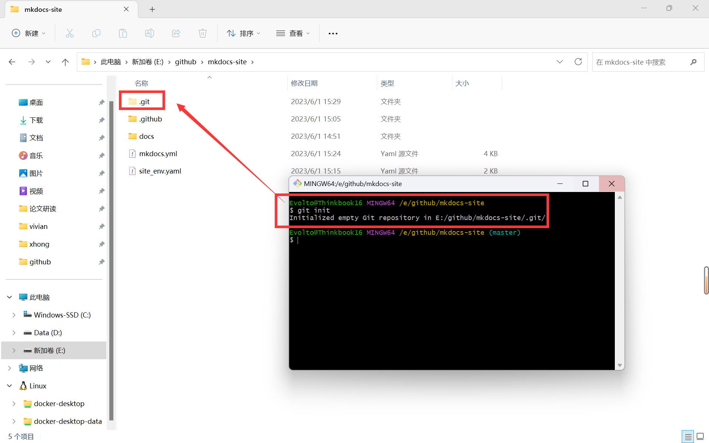
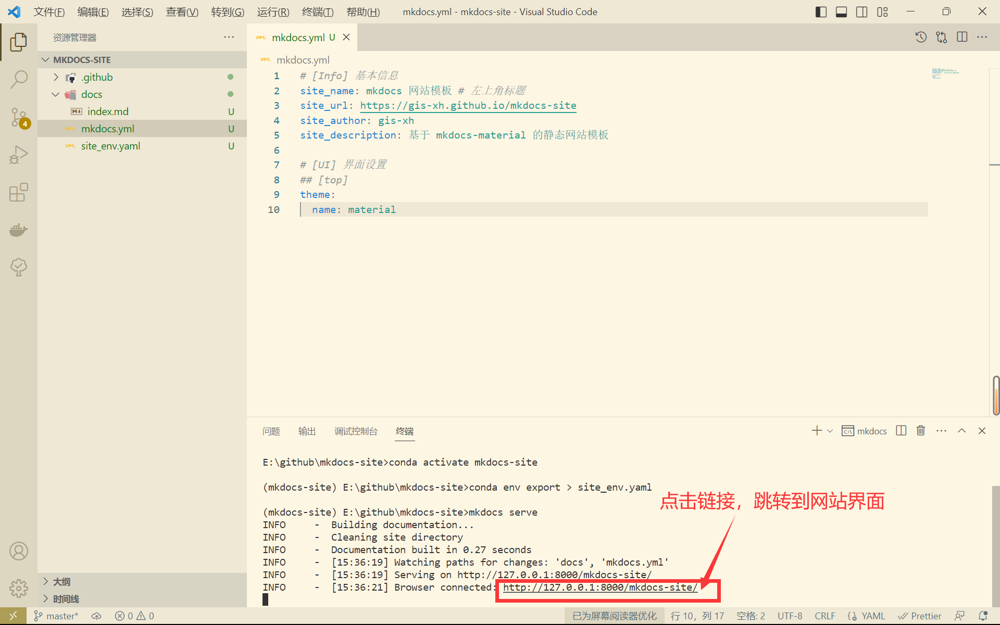
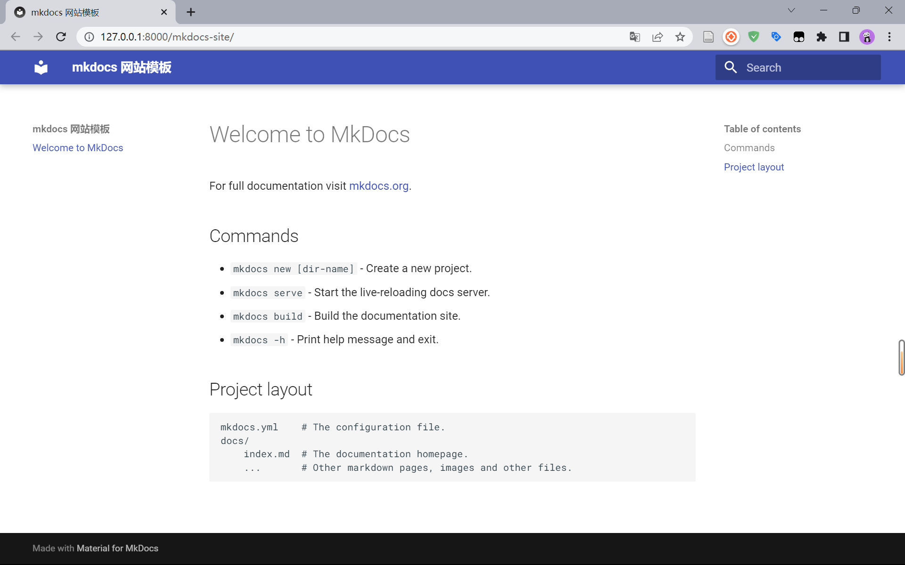

# 模板实现（一）搭建基础框架


## 1 配置虚拟环境

### 1.1 Conda 环境

&emsp;&emsp;首先，要保证本机存在 Miniconda / Anaconda 环境，才能进行后续操作。

&emsp;&emsp;如未安装请参考本篇内容进行安装：[Win11 安装配置 Miniconda 全过程记录 - 亚瑟的个人学习记录 (gis-xh.github.io)](https://gis-xh.github.io/my-note/python/01conda/Win11-Miniconda-install/)

> 创建虚拟环境

```sh
conda create -n mkdocs-site python=3.9 -y
```

### 1.2 安装相关包

&emsp;&emsp;以下的一系列包务必安装在创建好的 conda 环境中，先激活环境再进行包的安装。

> 激活环境

```sh
conda activate mkdocs-site
```

> 安装 mkdocs-material

```sh
pip install mkdocs-material
```

> 安装图像缩放工具

```sh
pip install mkdocs-glightbox
```

> 获取 github 文档时间

```sh
pip install mkdocs-git-revision-date-localized-plugin
```

>获取 github 作者

```sh
pip install mkdocs-git-authors-plugin
```

>文件元数据管理器

```sh
pip install mkdocs-meta-manager
```


## 2 项目基础内容配置

### 2.1 创建 MkDocs 项目

&emsp;&emsp;启动 cmd 命令行，激活虚拟环境，切换到目标目录使用 `mkdocs` 命令创建项目，这里以已经在 E 盘创建好了 github 文件夹为例。

> 切换到 E 盘并进入 github 文件夹

```sh
E:
cd github
```

> 新建一个 mkdocs 项目

```sh
mkdocs new mkdocs-site
```



<center>图 1 创建网站基础模板</center>

&emsp;&emsp;我们使用 VS Code 打开这个创建好的项目，它此时应该位于此目录：

```
E:\github\mkdocs-site
```



<center>图 2 项目初始目录</center>

### 2.2 配置工作流文件

&emsp;&emsp;在 VS Code 中使用 crtl + shift + ` 快捷键调出内部命令行，尽量使用命令行进行操作。

> 创建工作流目录

```sh
mkdir .github\workflows
```

&emsp;&emsp;在此目录下，创建 `*.yml` 文件（文件名称不限，这里以 `PublishMySite.yml` 为例），并添加以下内容。这个文件是配置在 GitHub 上部署网站时，GitHub Actions 需要自动化执行的相关命令。

==！！！这里一定要注意的是 `*.yml` 文件要放在工作流目录内部 ！！！==，否则 GitHub 不会执行工作流命令。

&emsp;&emsp;命令大致内容为：在本地将代码推送到 GitHub 上时，强力创建一个新分支 `gh-deploy` 用于部署网站，并且创建一个 Ubuntu 系统的云虚拟机，安装网站显示所需的一系列 Python 环境，网站也将部署在其中。

```yml
name: publish site
on: # 在什么时候触发工作流
  push: # 在从本地main分支被push到GitHub仓库时
    branches:
      - master
      - main
  pull_request: # 在main分支合并别人提的pr时
    branches:
      - main
permissions:
  contents: write
jobs: # 工作流的具体内容
  deploy:
    runs-on: ubuntu-latest # 创建一个新的云端虚拟机 使用最新Ubuntu系统
    steps:
      - uses: actions/checkout@v3 # 先checkout到main分支
        with:
          fetch-depth: 0 # 获取所有标签和分支的所有历史记录
      - uses: actions/setup-python@v4 # 再安装Python3和相关环境
        with:
          python-version: 3.x
      - run: echo "cache_id=$(date --utc '+%V')" >> $GITHUB_ENV
      - uses: actions/cache@v3
        with:
            key: mkdocs-material-${{ env.cache_id }}
            path: .cache
            restore-keys: |
              mkdocs-material-
      - run: pip install mkdocs-material # 使用pip包管理工具安装mkdocs-material
      - run: pip install mkdocs-glightbox # 安装图像缩放工具
      - run: pip install mkdocs-git-revision-date-localized-plugin # 获取github文档时间
      - run: pip install mkdocs-git-authors-plugin # 获取github作者
      - run: pip install mkdocs-meta-manager # 文件元数据管理器
      - run: mkdocs gh-deploy --force # 使用mkdocs-material部署gh-pages分支
```



<center>图 3 配置 GitHub 工作流</center>

### 2.3 备份虚拟环境

&emsp;&emsp;在激活环境的情况，将当前环境所有包及其版本信息保存到名为 `site_env.yaml` 的文件中，以便一比一完整复刻。

> 激活虚拟环境

```sh
conda activate mkdocs-site
```

> 克隆环境信息

```sh
conda env export > site_env.yaml
```



<center>图 4 备份虚拟环境信息</center>


## 3 启动模板

### 3.1 配置主题文档

&emsp;&emsp;打开 `mkdocs.yml` 配置文件，输入以下基本信息

```sh
# [Info] 基本信息
site_name: mkdocs 网站模板 # 左上角标题
site_url: https://gis-xh.github.io/mkdocs-site
site_author: gis-xh
site_description: 基于 mkdocs-material 的静态网站模板

# [UI] 界面设置
## [top]
theme:
  name: material
```

### 3.2 Git 初始化仓库

&emsp;&emsp;打开项目目录，用 Git 命令行打开目录，输入命令进行仓库初始化。

```sh
git init
```



<center>图 5 Git 初始化</center>

### 3.3 启动模板

&emsp;&emsp;回到 VS Code 命令行中，==！！！一定要保证仍处于虚拟环境中！！！==，输入命令运行项目查看效果。

```sh
mkdocs serve
```



<center>图 6 启动项目</center>

&emsp;&emsp;此时，网站已经可以正常显示了，形式如下。



<center>图 7 项目界面</center>


## 小结

&emsp;&emsp;到这里，网站的基础结构已经搭建完成，并且也能够在本地上成功运行了，下一步我们将在 GitHub 上进行相应的设置，让我们的网站成功的显示在互联网上。