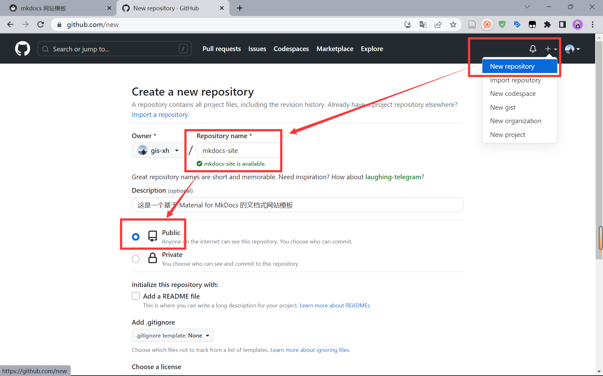
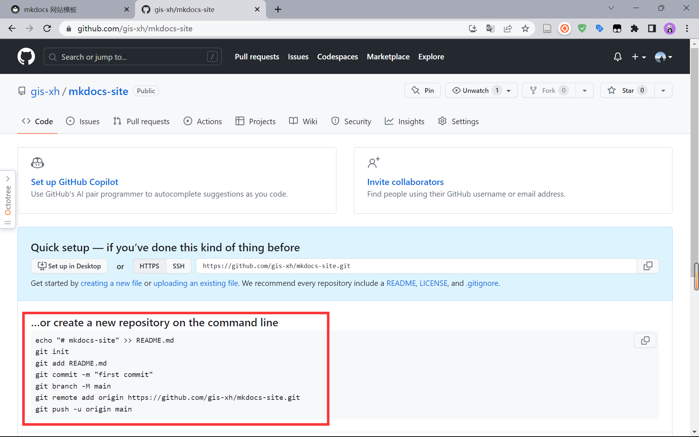
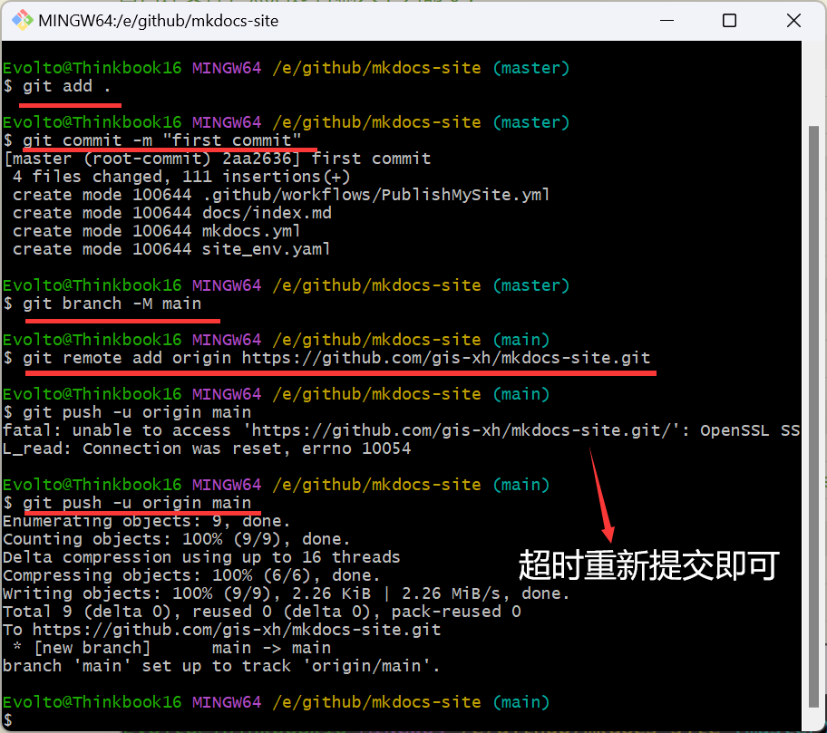
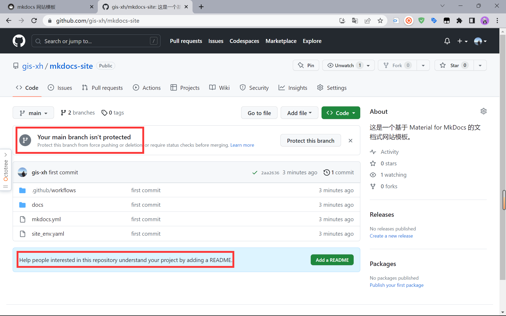
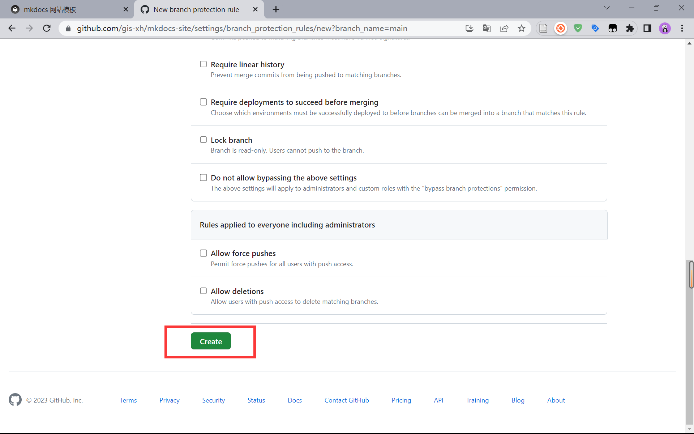
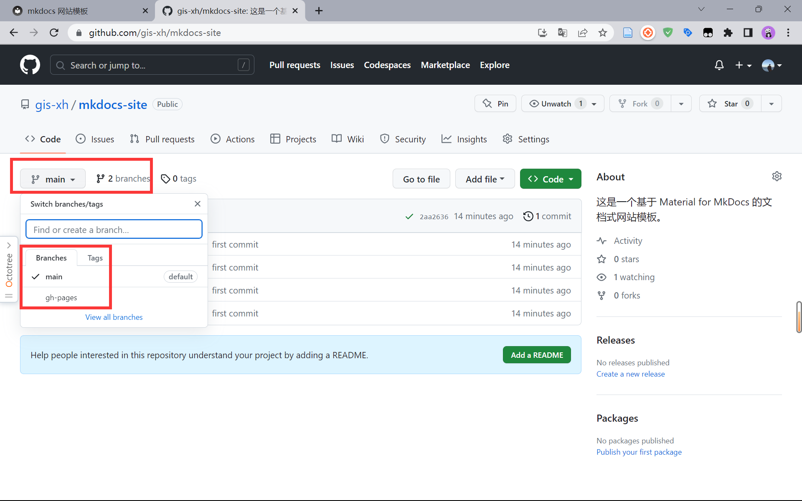
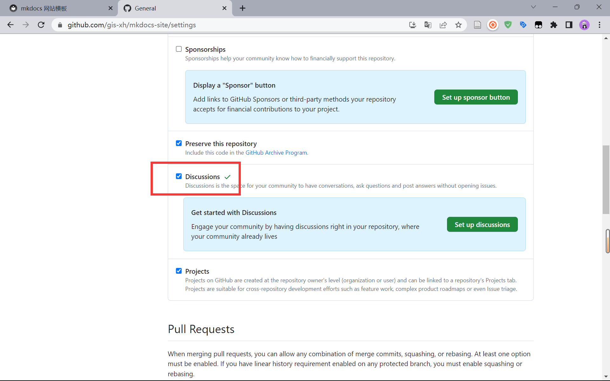
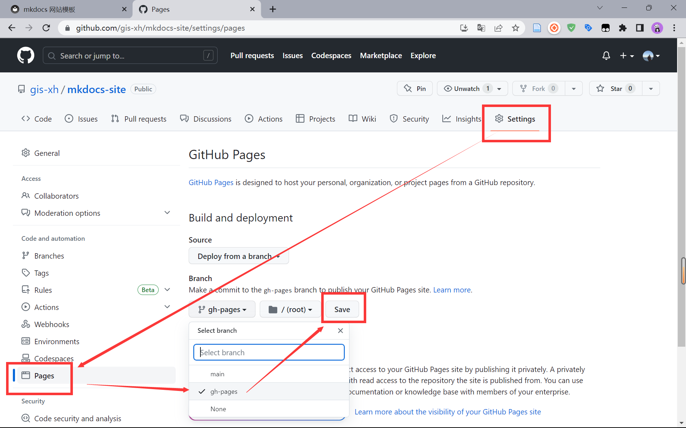
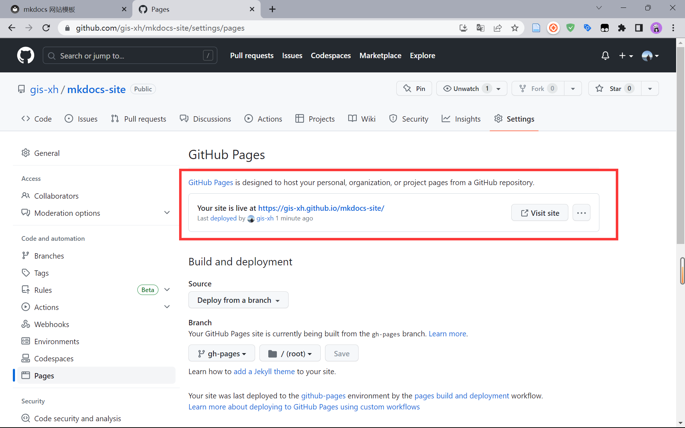
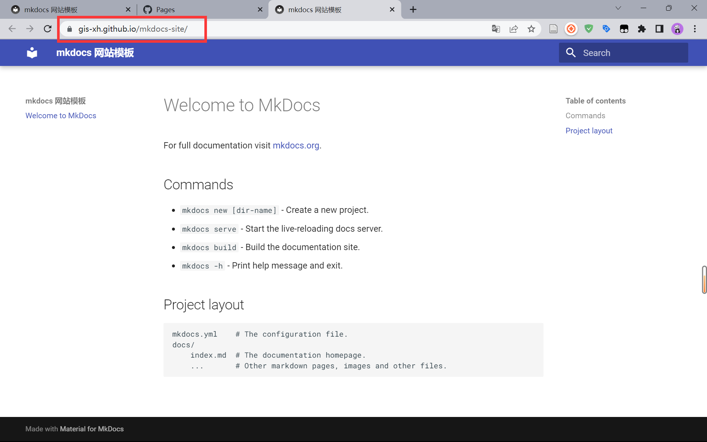

# 模板构建记录（二）GitHub 相关配置


&emsp;&emsp;为了使我们的网站顺利显示在互联网中，我们需要借助 GitHub Pages 实现对网站的在线部署，它是一个免费工具，但是在初次使用时需要进行一些配置。


## 1 创建 GitHub 仓库

### 1.1 创建公开仓库

&emsp;&emsp;GitHub Pages 必须使用 ==**公开仓库**== 才可以正常使用。



<center>图 1-1 创建 GitHub 新仓库</center>

&emsp;&emsp;每创建一个新的仓库，GitHub 都会提示我们仓库初始设置的一系列 Git 命令。接下来，我们需要按照提示在本地上运行 Git 命令。



<center>图 1-2 新仓库的基本 Git 操作</center>


## 2 Git 操作

### 2.1 首次提交

&emsp;&emsp;由于之前我们已经对项目目录进行了初始化，所以接下来先本地项目的根目录创建一个 `README.md` 项目自述文件，然后逐行输入下列命令：

> 将所有变动内容缓存

```sh
git add .
```

> 提交到本地仓库

```sh
git commit -m "first commit"
```

> 设置 main 为主分支

```sh
git branch -M main
```

> 设置 GitHub 仓库为远程仓库

```sh
git remote add origin https://github.com/gis-xh/mkdocs-site.git
```

>推送到远程仓库

```sh
git push -u origin main
```

&emsp;&emsp;在 push 提交时，可能会由于网络问题出现超时错误，再次提交即可。这一次的推送将会使 GitHub 执行工作流的内容，我们只需要再对 GitHub Pages 进行一些设置就可以将网站正式部署在互联网上。



<center>图 2-1 首次提交全过程记录</center>

### 2.2 查看 GitHub 仓库

&emsp;&emsp;刷新创建好的仓库界面，可以看到两个提示，这是由于我们之前没有创建了 README 自述文件，所以我们需要在本地填写一定的项目介绍内容再次推送让 GitHub 能够正常将显示出来。并且出于安全性考虑，我们需要将主分支 main 保护起来。



<center>图 2-2 查看首次提交结果</center>


## 3 GitHub 仓库设置

### 3.1 主分支保护

&emsp;&emsp;在仓库主界面中直接点击 Protect this branch 按钮，随后在跳转页面中点击 Create 即可。



<center>图 3-1 保护主分支</center>

&emsp;&emsp;此时我们回到主界面点击分支，可以看到，我们拥有了主分支 main 和 部署分支 gh-pages，说明工作流顺利运行了。



<center>图 3-2 查看分支</center>

### 3.2 打开 Discussions

&emsp;&emsp;由于我们的网站评论功能是借助 GitHub Discussions 实现的，所以需要在设置 Settings 里手动打开它，才可以被正常调用。



<center>图 3-3 打开 Discussions</center>

### 3.3 配置 GitHub Pages

&emsp;&emsp;最后，将 GitHub Pages 使用的分支设置为 gh-pages，点击 Save，就可以正式开始网站部署了。



<center>图 3-4 配置 GitHub Pages 分支</center>

&emsp;&emsp;稍等片刻，重新刷新页面，就可以看到网站已经成功部署了，并且给出了对应网址。



<center>图 3-5 成功部署</center>

- https://gis-xh.github.io/mkdocs-site/，这个网址将会向全互联网公开访问，并且内容显示也是与本地部署时一模一样的。



<center>图 3-6 查看网站</center>

### 3.4 再次提交

&emsp;&emsp;为了给网站一个自述文件说明，我们可以在本地项目根目录创建 `README.md` 文件，添加网站介绍并再次提交。除首次提交外，之后再向 GitHub 仓库提交只需要在项目根目录，逐行运行如下三个命令即可。

```sh
git add .
git commit -m "改动内容的描述"
git push
```


## 小结

&emsp;&emsp;到这里，网站的基础结构已经成功的显示在互联网上，可以根据自用需要对内容进行丰富完善。