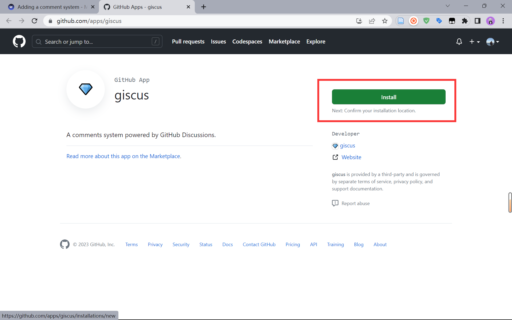
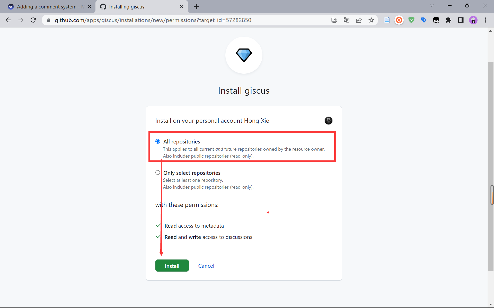
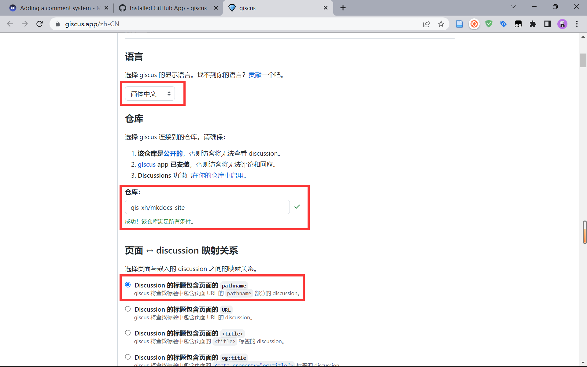
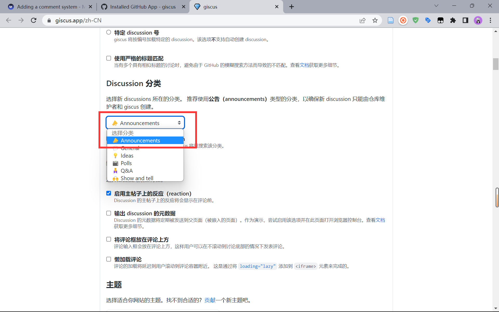
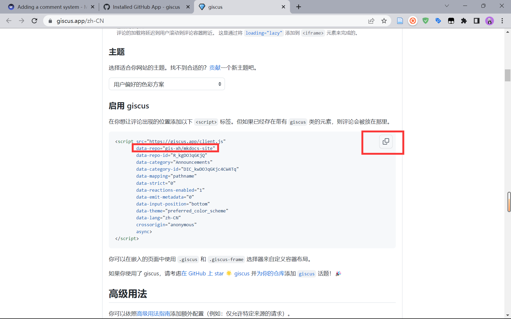
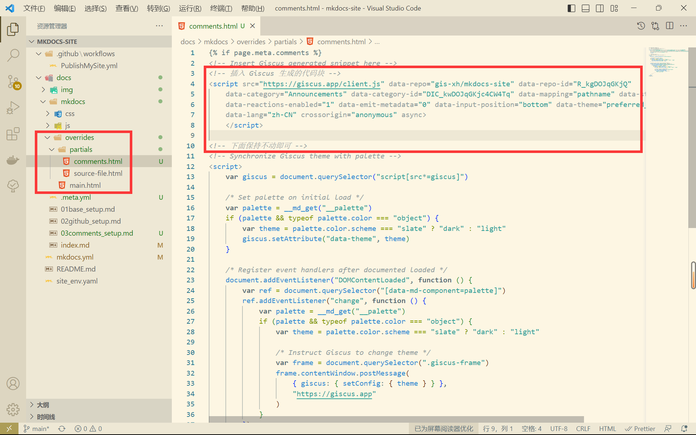
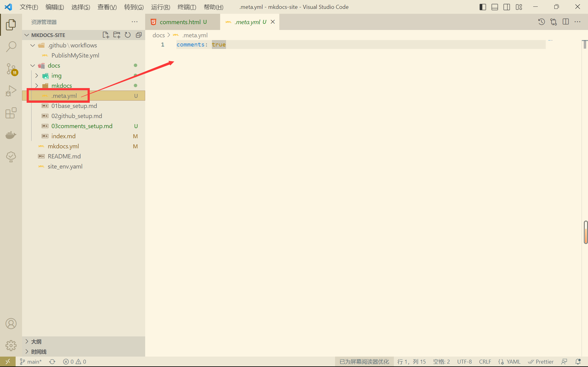
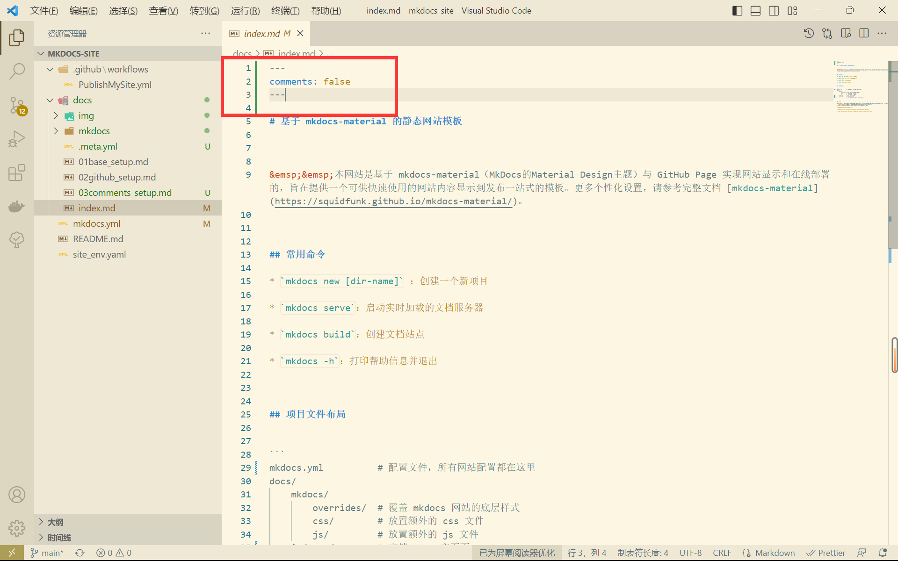

# 模板实现（三）评论系统配置


参考：[Adding a comment system - Material for MkDocs (squidfunk.github.io)](https://squidfunk.github.io/mkdocs-material/setup/adding-a-comment-system/)


&emsp;&emsp;为了使我们的网站能够免费实现评论功能，本模板将会集成 Giscus，它是开源免费的，并使用 GitHub Discussions 作为后端。


## 1 安装 Giscus 应用

&emsp;&emsp;我们需要在 GitHub 上安装 Giscus GitHub 应用程序，点击 [Giscus](https://github.com/apps/giscus) 跳转到安装界面，点击 Install 即可开始安装。



<center>图 1-1 安装 Giscus 应用</center>

&emsp;&emsp;这里会默认选择为所有仓库安装，我们保持默认就好。



<center>图 1-2 Giscus 安装配置</center>


## 2 Giscus 配置

&emsp;&emsp;点击访问 [Giscus](https://giscus.app/zh-CN)，输入需要添加评论功能的仓库名，使用其配置工具即可生成代码片段，复制到网站项目中就可以正式加载评论系统。

### 2.1 配置目标仓库

&emsp;&emsp;一般进入时默认显示成中文，如果没有的话可以自行修改一下，仓库输入的是示例仓库地址，Giscus 会自动识别仓库是否公开且开启了 Discussions。

```
gis-xh/mkdocs-site
```



<center>图 2-1 设置目标仓库名</center>

### 2.2 配置评论分类

&emsp;&emsp;这里设置的哪种分类，最后评论就会显示哪种分类，官方建议使用公告类型（Announcements）的分类，我们直接选择即可。



<center>图 2-2 设置评论分类</center>

### 2.3 生成代码块

&emsp;&emsp;在完成上面的配置后，Giscus 会自动生成一段代码段，这里我们先保存备用，后续会将其复制到网站项目中，实现网站评论功能。



<center>图 2-3 启用 Giscus 的代码块</center>

```html
<script src="https://giscus.app/client.js"
        data-repo="gis-xh/mkdocs-site"
        data-repo-id="R_kgDOJqGKjQ"
        data-category="Announcements"
        data-category-id="DIC_kwDOJqGKjc4CW4Tq"
        data-mapping="pathname"
        data-strict="0"
        data-reactions-enabled="1"
        data-emit-metadata="0"
        data-input-position="bottom"
        data-theme="preferred_color_scheme"
        data-lang="zh-CN"
        crossorigin="anonymous"
        async>
</script>
```


## 3 项目设置

### 3.1 comments 文件

&emsp;&emsp;在项目自定义样式目录 `docs/mkdocs/overrides` 中的 `partials/` 文件夹中，创建一个名为 `comments.html` 空文件。需要注意的是，由于使用的 `overrides/` 覆盖式的样式自定义，所以必须保证所有对应文件、文件夹的名称保持一致。



<center>图 3-1 启用 Giscus 的代码块</center>

&emsp;&emsp;输入以下内容，并将之前复制的 Giscus 生成的代码块添加到对应的位置中。

```html

<!-- Insert Giscus generated snippet here -->
<!-- 插入 Giscus 生成的代码块 -->


<!-- 下面保持不动即可 -->
<!-- Synchronize Giscus theme with palette -->
<script>
    var giscus = document.querySelector("script[src*=giscus]")

    /* Set palette on initial load */
    var palette = __md_get("__palette")
    if (palette && typeof palette.color === "object") {
        var theme = palette.color.scheme === "slate" ? "dark" : "light"
        giscus.setAttribute("data-theme", theme)
    }

    /* Register event handlers after documented loaded */
    document.addEventListener("DOMContentLoaded", function () {
        var ref = document.querySelector("[data-md-component=palette]")
        ref.addEventListener("change", function () {
            var palette = __md_get("__palette")
            if (palette && typeof palette.color === "object") {
                var theme = palette.color.scheme === "slate" ? "dark" : "light"

                /* Instruct Giscus to change theme */
                var frame = document.querySelector(".giscus-frame")
                frame.contentWindow.postMessage(
                    { giscus: { setConfig: { theme } } },
                    "https://giscus.app"
                )
            }
        })
    })
</script>

```

### 3.2 meta 文件头

&emsp;&emsp;在 `docs/` 目录创建 `.meta.yml` 文件，输入以下内容，即可为整个项目网站开启评论功能。

```
comments: true
```



<center>图 3-2 批量开启评论功能</center>

### 3.3 关闭评论

&emsp;&emsp;在不需要评论的界面如主页，关闭评论功能，需要在对应的 markdown 文件头部书写以下内容。

```markdown
---
comments: false
---
```



<center>图 3-3 关闭评论功能</center>


## 小结

&emsp;&emsp;到这里，网站的评论功能也已经成功实现，接下来只需要将变动推送到 git 上即可在网站上正常实现评论功能。
